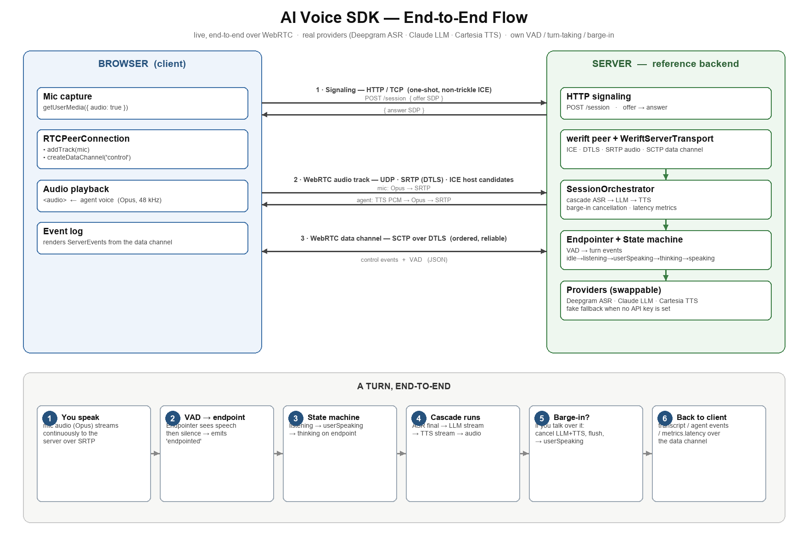

# AI Voice SDK

A from-scratch, **real-time AI voice agent** over WebRTC — talk to it, it talks back, interrupt it mid-sentence and it stops. Vendor-neutral: ASR, LLM, and TTS are pluggable adapters (defaults: **Deepgram · Claude · Cartesia**). The interesting part isn't the providers — it's the **session layer** that sits between them: server-side voice-activity detection, turn-taking, barge-in cancellation, and per-turn latency instrumentation.

**TypeScript · WebRTC (werift) · 70 passing tests · Apache-2.0 · live demo deployed**

---

## TL;DR

> The short version — read this, skim the diagram, and you've got it.

- **What it is.** A reference backend + browser client that run a full voice loop: your mic → WebRTC → server-side turn detection → ASR → LLM → TTS → the agent's voice streamed back, all in ~1–1.4 s end-to-end.
- **What's actually hard here** (and built from scratch, not bought): **endpointing** (knowing when *you* stopped talking), **turn-taking** as an explicit state machine, and **barge-in** — interrupt the agent and it cancels the in-flight LLM + TTS instantly.
- **Vendor-neutral by design.** Each provider hides behind a small adapter interface. No API key for a stage? It transparently falls back to a fake, so the whole thing runs offline with zero credentials.
- **Latency is a feature.** Every turn emits a breakdown (LLM first-token / generate / TTS) that the demo plots live, so the cost of each stage is visible instead of guessed at.
- **Real WebRTC, server-side.** ICE / DTLS / SRTP / SCTP data channel via [`werift`](https://github.com/shinyoshiaki/werift-webrtc) — not a websocket pretending to be a call.
- **Tested and deployed.** 70 unit/integration tests; running live behind TLS on a single small VPS.

```bash
git clone https://github.com/alitalari/rtc_sdk.git && cd rtc_sdk
npm install && npm run build
npm start -w @voice/server          # → open http://localhost:8080 and talk
```
No API keys required for that — it boots on fake providers (a tone + canned transcript) so you can see the whole pipeline work before wiring real ones.



---

## Quickstart — clone & run

**Prerequisites:** Node ≥ 20 and a Chromium/Firefox browser (microphone access needs a secure context — `localhost` counts).

```bash
# 1. Clone
git clone https://github.com/alitalari/rtc_sdk.git
cd rtc_sdk

# 2. Install (npm workspaces) and build (tsc -b across all packages)
npm install
npm run build

# 3. Run the reference server + demo page
npm start -w @voice/server
#    → "@voice/server dev server on http://localhost:8080"

# 4. Open http://localhost:8080, click Connect, allow the mic, and talk.
```

Out of the box every stage uses a **fake provider** (the LLM returns a canned line, the TTS plays a tone), so the full WebRTC + turn-taking + barge-in loop works with **no credentials and no network**.

### Run it for real

Drop your keys into a gitignored env file and the matching stages swap from fake → real automatically:

```bash
cp apps/server/.env.example apps/server/.env
# edit apps/server/.env:
#   DEEPGRAM_API_KEY=...     (console.deepgram.com)   → real ASR
#   ANTHROPIC_API_KEY=...    (console.anthropic.com)  → real LLM (Claude)
#   CARTESIA_API_KEY=...     (play.cartesia.ai)       → real TTS
npm run build && npm start -w @voice/server
```

Each key is independent — set one, two, or all three; unset stages stay on the fake. Keys are read **server-side only** and never reach the browser.

### Develop

```bash
npm run build          # tsc -b — also the typecheck
npm test               # vitest — 70 tests across 9 files
npm run test:coverage
npm run lint           # eslint (flat config)
npm run format         # prettier --check
```

### Live demo

A hosted instance runs behind TLS + a password gate: **https://voice.alitalari.com** (access on request). The ungated health endpoint — `…/status` — returns which providers are live.

---

## Deep dive

> The verbose version — architecture, the hard parts, and why they're built the way they are.

### The problem this solves

Gluing ASR → LLM → TTS together is a weekend project. Making it feel like a *conversation* is not. The session layer is where the real work lives:

- **When did the user stop talking?** Too eager and you cut them off mid-sentence; too patient and the agent feels slow. This is *endpointing*, and it's tuned here, not delegated.
- **Who's turn is it?** Listening, the user speaking, the agent thinking, the agent speaking — these are explicit states with explicit transitions, not implicit timing hacks.
- **What happens when the user interrupts?** A real conversation lets you talk over the other person. *Barge-in* means the moment the user speaks, the in-flight LLM stream and TTS playback are cancelled and the floor returns to the user — within a frame.

This repo owns those three things and treats the providers as swappable commodities underneath.

### A turn, end to end

1. **You speak.** The browser captures the mic (`getUserMedia`), Opus-encodes it, and streams it over an SRTP audio track to the server.
2. **VAD → endpoint.** The server decodes the audio and runs an energy-based **voice-activity detector** with hangover smoothing. Sustained speech opens a turn; a silence threshold closes it (`endpointed`). Audio flows *continuously* to the ASR so it can do its own segmentation — the VAD drives *turn-taking*, not the transcript.
3. **State machine.** `idle → listening → userSpeaking → thinking → speaking`. The endpoint event moves `userSpeaking → thinking`; the agent's audio completing moves `speaking → listening`.
4. **Cascade runs.** On endpoint, the final transcript goes to the LLM. The response is streamed **sentence by sentence** — each completed sentence is sent to TTS immediately rather than waiting for the full answer, which is the single biggest latency win.
5. **Barge-in.** If the user speaks while the agent is talking, a generation counter invalidates the in-flight response: the LLM stream is aborted, queued TTS is flushed, and the state machine snaps back to `userSpeaking`.
6. **Back to the client.** Transcript fragments, agent text, and a `metrics.latency` breakdown (LLM first-token / generate / TTS) stream over the WebRTC **data channel** and render live in the demo.

### Transport: real WebRTC, server-side

The server is a genuine WebRTC peer via [`werift`](https://github.com/shinyoshiaki/werift-webrtc) (pure TypeScript): ICE, DTLS, SRTP for audio, and an SCTP data channel for control. Signaling is a single non-trickle `POST /session` (offer → answer). Inbound mic audio is Opus-decoded for VAD + ASR; the agent's voice is PCM → Opus-encoded onto an owned return track. This is a real call, not a websocket audio relay.

### Pluggability: the adapter seams

Two narrow interfaces make everything swappable:

- **`ServerTransport`** — how the session layer talks to the outside world (send audio, send events, receive audio/VAD/control). The WebRTC implementation is one impl; tests use an in-memory loopback impl. The orchestrator has no idea WebRTC exists.
- **ASR / Model / TTS adapters** — each provider is ~100 lines behind a streaming interface. Deepgram, Claude, and Cartesia are the real ones; the fakes implement the same contracts with realistic timing so the demo behaves like the real thing offline.

That seam is the point: the session logic is provider-agnostic and transport-agnostic, which is exactly what makes it testable.

### Latency

System latency (your endpoint → first agent audio) runs ~1.0–1.4 s and is dominated by LLM time-to-first-token (~500–900 ms, a network/model floor). The wins that are in our control are all implemented: **sentence-streaming** the LLM→TTS handoff, a **connection warmup** on the LLM client, and a capped prompt/history so context stays small. The demo's stacked latency chart makes each stage's contribution visible per turn.

### Monorepo layout

```text
packages/
  session/              VAD, endpointer, turn-taking state machine (pure, no I/O)
  media/                energy VAD, hangover gate, resampling
  orchestrator/         the ASR→LLM→TTS cascade, barge-in, latency metrics
  protocol/             wire types — client/server events, latency metrics
  provider-interfaces/  ASR / Model / TTS / Transport adapter contracts
  fake-providers/       offline fakes with realistic timing
  web-sdk/              browser-side session helper
apps/
  server/               reference backend: werift transport + real providers + demo page
  web-demo/             browser demo scaffold
docs/                   architecture, rtc, providers, deployment, testing, observability
```

The dependency arrow only points one way: `session` and `media` are pure and know nothing about providers or WebRTC; the `orchestrator` wires them to adapters; `apps/server` picks the concrete providers and transport.

### Testing

70 tests (vitest) concentrate on the parts where correctness is subtle and bugs are silent: the state machine's transition table, endpointing thresholds, the VAD hangover gate, resampling, and the orchestrator's barge-in cancellation (via the loopback transport). The bias is toward tests that encode *why* a behavior matters — e.g. a barge-in test fails if a cancelled turn is ever reported as completed.

### Docs

- [Architecture](./docs/architecture.md) · [RTC / STUN / TURN](./docs/rtc.md) · [Providers](./docs/providers.md)
- [Deployment](./docs/deployment.md) · [Testing](./docs/testing.md) · [Observability](./docs/observability.md)

---

## About

Built as a deep-dive into real-time media engineering — owning the session layer (turn-taking, barge-in, latency) rather than calling a hosted voice API. Open source under **Apache-2.0**; contributions and questions welcome via issues.

## License

[Apache-2.0](./LICENSE).
